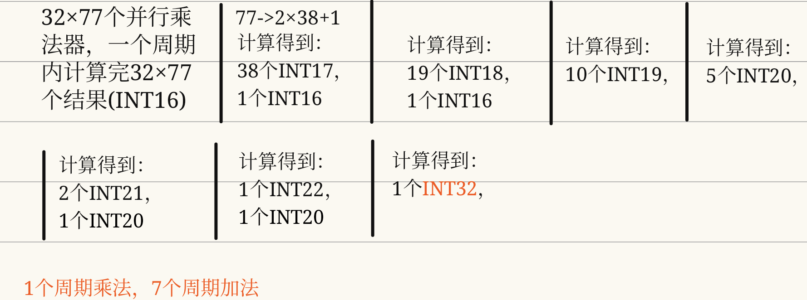

# CNN 加速器整体架构设计

> 面向 SJTU MST3314 课程设计 · 高性能场景（Speed ≥ 1000K FPS）
> 目标工艺：0.18μm，预期时钟频率：150 ~ 200 MHz

---

## 目录

1. [性能指标反推：1000K FPS 意味着什么？](#1-性能指标反推)
2. [整体架构概述](#2-整体架构概述)
3. [层间流水线策略](#3-层间流水线策略)
4. [各层并行度设计](#4-各层并行度设计)
5. [SRAM 组织与带宽分析](#5-sram-组织与带宽分析)
6. [控制器（FSM）设计思路](#6-控制器fsm设计思路)
7. [关键 Trade-off 与建议](#7-关键-trade-off-与建议)
8. [模块分工建议](#8-模块分工建议)

---

## 1. 性能指标反推

### 1.1 从 FPS 推算每帧可用周期数

高性能场景要求：**Speed ≥ 1000K FPS**（即每秒处理 100 万帧输入特征图）。

设 0.18μm 工艺下可综合的时钟频率为 $f_{clk}$，每帧可用的时钟周期数为 $T_{frame}$：

$$T_{frame} = \frac{f_{clk}}{\text{Speed}} = \frac{f_{clk}}{10^6}$$

| 时钟频率 | 每帧周期预算 |
|---------|------------|
| 150 MHz | **150 周期** |
| 180 MHz | **180 周期** |
| 200 MHz | **200 周期** |

> **保守设计目标**：按 150 MHz 设计，每帧不超过 **150 个时钟周期**。

### 1.2 计算量分析（来自 PyRTL-CNN README）

PyRTL-CNN 的串行行为模型共执行了 **244,928 次 MAC 操作**：

| 层 | MAC 次数 | 占比 |
|----|---------|------|
| Conv (11×7, 32 通道) | 32 × 20 × 4 × 11 × 7 = **197,120** | **80.5%** |
| PWConv (1×1, 32→32) | 32 × 18 × 2 × 32 = **36,864** | 15.0% |
| DWConv (3×3, 32 通道) | 32 × 18 × 2 × 3 × 3 = **10,368** | 4.2% |
| FC (288→2) | 2 × 288 = **576** | 0.2% |
| **合计** | **244,928** | 100% |

若每帧只有 150 周期，则平均每周期需要完成：

$$\frac{244928}{150} \approx 1633 \text{ 次 MAC}$$

这要求**极高的并行度**，远超串行实现。

### 1.3 参考设计对比

课程 Skill-Plan.md 提示：

> 学长（上届）用了 **288 个周期**（对应约 **150MHz / 288 ≈ 521K FPS**，不满足 1000K 要求）。
> 需要将并行度翻倍，使每帧缩短到 ≤ **150 周期**。

---

## 2. 整体架构概述

### 2.1 数据流总览

```
外部输入
    │
    ▼
┌─────────────┐
│  input_sram │  (300B, 1×30×10, INT8)
└──────┬──────┘
       │ 逐行读取，输入 LineBuffer
       ▼
┌──────────────────┐    ┌──────────────────┐
│   Conv 模块      │───▶│ conv_out_sram(A/B)│  (2×2560B, Ping-Pong)
│  (32 并行通道)   │    └──────┬───────────┘
│  77 路 MAC 树    │           │
└──────────────────┘           ▼
                       ┌──────────────────┐    ┌────────────────────┐
                       │  DWConv 模块     │───▶│ dwconv_out_sram(A/B)│  (2×1152B)
                       │  (32 独立通道)   │    └──────┬─────────────┘
                       └──────────────────┘           │
                                                      ▼
                                             ┌──────────────────┐    ┌────────────────────┐
                                             │  PWConv 模块     │───▶│ pwconv_out_sram    │  (1152B)
                                             │  (32 出通道并行)  │    └──────┬─────────────┘
                                             └──────────────────┘           │
                                                                            ▼
                                                                   ┌─────────────────┐
                                                                   │ PostProcess 模块 │
                                                                   │  MaxPool         │
                                                                   │  Flatten         │
                                                                   │  FC              │
                                                                   │  Sigmoid LUT     │
                                                                   └────────┬─────────┘
                                                                            ▼
                                                                      分类结果 (2 bits)
```

### 2.2 关键设计决策

1. **Conv 是计算瓶颈**：占总 MAC 量的 80.5%，必须最大化 Conv 层的并行度
2. **层间 Ping-Pong Buffer**：Conv/DWConv 之间使用双 Bank SRAM 实现流水
3. **PostProcess 串行执行**：MaxPool→Flatten→FC→Sigmoid 计算量小，不需要特殊并行化

---

## 3. 层间流水线策略

### 3.1 目标：以 Conv 层为节拍器

Conv 层在 80 个周期内完成（见第 4 节分析），以其作为流水线的"节拍器"：

```
帧 N 时间线（总 ~80 周期）：
  [0 ~ 79]    Conv处理帧N → 写 conv_out Bank A
  [80 ~ 119]  DWConv处理帧N(读Bank A) || Conv处理帧N+1 → 写 Bank B
  [120 ~ 159] PWConv处理帧N || DWConv处理帧N+1 || Conv处理帧N+2
  [160 ~ ~]   PostProcess || PWConv || DWConv || Conv
```

**稳态吞吐量**（流水线充满后）：

$$\text{每隔 80 周期输出一帧结果} \Rightarrow \text{Speed} = \frac{150\text{MHz}}{80} = 1.875\text{M FPS} \gg 1000\text{K}$$

> **注意**：层间流水线的前提是每一层的延迟 ≤ Conv 层延迟（80周期）。若某层较慢，则该层成为新的瓶颈。各层延迟分析见下节。

### 3.2 层间 Ping-Pong 控制信号

```verilog
// 顶层控制器维护全局 Ping-Pong 状态
reg pong_sel;  // 0: Conv写A/DWConv读B; 1: Conv写B/DWConv读A

// Conv 完成一帧后切换
always @(posedge clk) begin
    if (conv_frame_done)
        pong_sel <= ~pong_sel;
end
```

---

## 4. 各层并行度设计

### 4.1 Conv 层（核心瓶颈层）

**输出规模**：32 通道 × 20行 × 4列 = 2560 个输出像素，每个像素需要 11×7=77 次 MAC

**推荐架构：32 通道全并行 + 完全展开核（Fully Unrolled Kernel）**

```
32 个独立 MAC 阵列（每个阵列处理 1 个输出通道）
  ├── 阵列 0：output channel 0
  │     77 个乘法器 + 7级加法树 → 1 拍出 1 个 INT32
  ├── 阵列 1：output channel 1
  │     ...
  └── 阵列 31：output channel 31
        ...

每拍处理：32个通道 × 1个(j,k)像素 = 32个输出像素
需要拍数：OUT_H × OUT_W = 20 × 4 = 80 拍
```

**关键资源**：32 × 77 = **2,464 个 INT8 乘法器**

加法树（7 级）的流水线延迟约 7 个时钟，需要在控制器中计入。

**Verilog 架构骨架**：

```verilog
// Conv 层：32 通道并行，77 路 MAC 树
module Conv_Core (
    input  wire        clk,
    input  wire        rst_n,
    input  wire        start,
    // 输入：来自 LineBuffer 的 11×7 窗口（77 个 INT8）
    input  wire signed [7:0] act_window [0:76],    // 激活值
    // 权重：32 个卷积核各 77 个 INT8（来自 Weight SRAM 预加载的寄存器文件）
    input  wire signed [7:0] weight_all [0:31][0:76],
    // 输出：32 个 INT32 累加结果
    output wire signed [31:0] out_int32 [0:31],
    output wire               out_valid
);

genvar ch;
generate
    for (ch = 0; ch < 32; ch = ch + 1) begin : CONV_CH
        // 每个通道：77路乘法器
        wire signed [15:0] products [0:76];
        genvar k;
        for (k = 0; k < 77; k = k + 1) begin : MAC
            assign products[k] = act_window[k] * weight_all[ch][k];
        end

        // 7级加法树（此处简化为直接相加，实际需要流水线寄存器）
        wire signed [31:0] sum;
        assign sum = products[0] + products[1] + ... + products[76];
        assign out_int32[ch] = sum;
    end
endgenerate

endmodule
```

> **实际编码提示**：77 级直接累加会产生很长的关键路径，需要插入寄存器把它切成 7 级流水线（每级约 11 个加法器）。


**预期延迟（不含 fill）**：

| 阶段 | 延迟 |
|------|------|
| LineBuffer 填充（等待前 11 行到位）| 11 × 10 = 110 行×列次 SRAM 读取，由控制器管理 |
| 卷积核计算（80 个输出位置）| **80 个时钟周期** |
| 加法树 pipeline fill | **7 个时钟周期** |
| 重量化（2级流水线）| 2 个时钟周期（已流水，不占用额外时间） |
| **小计** | **~87 个时钟周期（稳态延迟）** |

### 4.2 DWConv 层（深度可分离卷积）

**输出规模**：32 通道 × 18行 × 2列 = 1152 个像素，每个像素 3×3=9 次 MAC

**推荐架构：32 通道全并行 + 完全展开核（9路MAC树）**

```
32 个独立 MAC 阵列（每个通道独立，无跨通道）
  每阵列：9 个乘法器 + 3级加法树 → 1 拍出 1 个 INT32
需要拍数：OUT_H × OUT_W = 18 × 2 = 36 拍
```

**关键资源**：32 × 9 = **288 个乘法器**（远小于 Conv 层）

**预期延迟**：~36 + 3 = **39 个时钟周期** ≤ 87（不构成瓶颈 ✓）

### 4.3 PWConv 层（逐点卷积）

**输出规模**：32 通道 × 18行 × 2列 = 1152 个像素，每个像素 32 路点积

**推荐架构：32 输出通道并行 + 完全展开 32 路点积**

```
32 个 MAC 阵列（每阵列处理 1 个输出通道）
  每阵列：32 个乘法器 + 5级加法树
需要拍数：OUT_H × OUT_W = 18 × 2 = 36 拍
```

**关键资源**：32 × 32 = **1024 个乘法器**

**预期延迟**：~36 + 5 = **41 个时钟周期** ≤ 87（不构成瓶颈 ✓）

> **面积 Trade-off**：若 1024 乘法器面积压力过大，可减半为 16 个输出通道并行（2064 个乘法器）：延迟 = 72 + 5 ≈ 77 周期，仍在预算内。

### 4.4 PostProcess 层（MaxPool → Flatten → FC → Sigmoid）

这几层计算量极小，计划**串行处理**（不需要高并行度）：

| 层 | 操作数 | 串行延迟（1 比较/乘法器）| 建议方案 |
|----|--------|----------------------|---------|
| MaxPool | 32×9×1 = 288 个比较 | ~36 周期 | 32通道并行比较，1周期/位置 |
| Flatten | 地址重排 | 0 额外周期（地址映射即可） | 控制器地址逻辑 |
| FC | 2 × 288 MAC | 288 周期（串行）或 ≤ 72 周期（4路并行） | 4路并行 MAC |
| Sigmoid | 查找 256 条目 LUT | 2 周期（1次查表） | LUT |

**FC 层推荐**（4路并行 MAC）：

```
2 个输出神经元同时计算（并行）
每个神经元：288 输入，4路并行 MAC → 288/4 = 72 个周期
```

总 PostProcess 延迟：36 + 72 + 2 ≈ **110 周期**

> 注意：PostProcess 延迟 > Conv 延迟（87周期），因此 PostProcess **成为系统瓶颈**！

### 4.5 系统瓶颈分析与修正

| 层 | 延迟（周期） | 是否瓶颈 |
|----|------------|---------|
| Conv | ~87 | 否 |
| DWConv | ~39 | 否 |
| PWConv | ~41 | 否 |
| PostProcess | **~110** | **是（瓶颈）** |

**修正方案**：提升 FC 层并行度，以降低 PostProcess 总延迟。

将 FC 层从 4 路并行改为 **8 路并行**：
- 每神经元：288/8 = 36 周期
- PostProcess 总延迟：36 + 36 + 2 = **74 周期 < 87 周期 ✓**

此时系统吞吐量由 Conv（87周期）决定：

$$\text{Speed} = \frac{150\text{MHz}}{87} \approx 1.72\text{M FPS} \gg 1000\text{K FPS} \checkmark$$

---

## 5. SRAM 组织与带宽分析

### 5.1 总 SRAM 容量规划

| SRAM | 容量 | 是否 Ping-Pong | 总字节 |
|------|------|--------------|------|
| input_sram | 300B | 否 | 300B |
| conv_out_sram | 2560B | **是 × 2** | 5120B |
| dwconv_out_sram | 1152B | **是 × 2** | 2304B |
| pwconv_out_sram | 1152B | 否（下游快） | 1152B |
| maxpool_out_sram | 288B | 否 | 288B |
| conv_weight_sram | 2464B | 否（只读） | 2464B |
| dwconv_weight_sram | 288B | 否 | 288B |
| pwconv_weight_sram | 1024B | 否 | 1024B |
| fc_weight_sram | 576B | 否 | 576B |
| sigmoid_lut | 1024B (FP32) | 否 | 1024B |
| **合计** | | | **~14.5 KB** |

### 5.2 带宽瓶颈分析

Conv 层每个周期需要读取：
- **激活值**：11×7 = 77 个 INT8（来自 LineBuffer，已预缓存，不占 SRAM 带宽）
- **权重**：32 × 77 = 2464 个 INT8

如果权重每周期都从 SRAM 读取，需要 2464 × 8 bit = **2464 bit/cycle** 的读带宽，这是普通 SRAM 做不到的。

**解决方案**：**权重寄存器文件（Weight Register File）**

由于 Conv 层的权重在整个推理过程中**固定不变**，可以在计算开始前将所有 32 × 77 = 2464 个权重从 Weight SRAM 预加载到**片上寄存器**中，计算时直接从寄存器读取（每周期可读取任意数量的寄存器，无带宽限制）：

```verilog
// 预加载权重寄存器文件
reg signed [7:0] conv_weight_reg [0:31][0:10][0:6];  // 32×11×7 = 2464 个 INT8 寄存器

// 上电/复位后，控制器将权重 SRAM 内容逐个读入寄存器（需要 2464 个时钟周期）
// 推理过程中，寄存器保持不变，计算模块直接读取
```

这样代价是：2464 个 1字节寄存器的面积（每个约 8 个 DFF，共 ~20K 个 DFF），在 0.18μm 工艺下约 0.01-0.05 mm²，是可接受的。

---

## 6. 控制器（FSM）设计思路

整个芯片由一个**顶层控制器（Top FSM）** 协调，它驱动各层模块的 `start`/`done` 信号以及 SRAM 地址生成器。

### 6.1 顶层 FSM 状态机

```
IDLE
  │ (start_inference)
  ▼
LOAD_WEIGHTS              ← 将权重 SRAM 内容预加载到寄存器（~2500周期，一次性）
  │ (weight_loaded)
  ▼
WAIT_INPUT                ← 等待输入特征图写入 input_sram
  │ (input_ready)
  ▼
CONV_START                ← 启动 Conv 模块
  │ (conv_frame_done)
  ▼                       ← 同时启动 DWConv（层间流水）
DWCONV_PWconv_OVERLAP     ← DWConv、PWConv 流水化并行运行
  │ (pwconv_done)
  ▼
POSTPROCESS               ← MaxPool → FC → Sigmoid 顺序执行
  │ (sigmoid_done)
  ▼
OUTPUT_READY              ← 输出分类结果
  │
  ▼
WAIT_INPUT（等待下一帧）
```

### 6.2 地址生成器（AGU）

每个计算层配备一个**地址生成计数器**，自动产生输入/输出 SRAM 的地址序列：

```verilog
// Conv 层地址生成示意
reg [4:0] cnt_i;  // 输出通道计数 0~31
reg [4:0] cnt_j;  // 输出行计数 0~19
reg [2:0] cnt_k;  // 输出列计数 0~3

// 每周期递增
always @(posedge clk) begin
    if (conv_start) begin
        cnt_i <= 0; cnt_j <= 0; cnt_k <= 0;
    end else if (conv_running) begin
        // k 最快变化，i 最慢（与权重 SRAM 读取顺序对应）
        if (cnt_k == OUT_W - 1) begin
            cnt_k <= 0;
            if (cnt_j == OUT_H - 1) begin
                cnt_j <= 0;
                cnt_i <= cnt_i + 1;
            end else cnt_j <= cnt_j + 1;
        end else cnt_k <= cnt_k + 1;
    end
end

// 当前处理的位置决定 SRAM 地址
assign out_sram_addr = cnt_i * OUT_H * OUT_W + cnt_j * OUT_W + cnt_k;
```

---

## 7. 关键 Trade-off 与建议

### 7.1 并行度 vs 面积

| 方案 | Conv 乘法器数 | PWConv 乘法器数 | 预期 Conv 延迟 | 面积压力 |
|------|-------------|--------------|-------------|---------|
| 完全展开（推荐） | 32×77=2464 | 32×32=1024 | 80 周期 | 较大 |
| 半展开 | 32×77=2464 | 16×32=512 | 80+80=160 周期（PWConv 瓶颈） | 适中 |
| 仅通道并行 | 32×1=32（串行77） | 32×1=32（串行32） | 80×77=6160周期 | 很小 |

**建议选择完全展开方案**（第一行），理由：
- 高性能场景的评分重点是 `Speed/Area`，高速比高面积效率更重要
- 0.18μm 工艺芯片面积通常以 mm² 计，2464 个乘法器可接受

### 7.2 乘法器实现方式选择

INT8 × INT8 乘法器在 0.18μm 工艺下的实现方式：

| 方式 | 面积 | 延迟 | 推荐 |
|------|------|------|------|
| 标准单元综合（`*` 运算符） | 由 DC 自动优化 | DC 自动调整 | **推荐**（直接写 `a * b`，交给 DC） |
| Booth 编码乘法器 | 小 | 较快 | 手动实现难度大，不推荐 |
| 移位加法实现 | 大 | 慢 | 不推荐 |

直接在 Verilog 中写 `$signed(a) * $signed(b)`，让 Design Compiler 负责映射到工艺库的乘法器单元。

### 7.3 处理 SRAM 读写冲突

单端口 SRAM 同一时刻只能读或写，不能同时。在设计中需要注意：

1. **PWConv 输出 SRAM**：PWConv 写入的同时 PostProcess 不能读取（串行安排即可）
2. **Conv 输出 SRAM（Ping-Pong）**：Conv 写 Bank A，DWConv 读 Bank B，不冲突

若时序上真的需要同一周期读写同一 SRAM，可考虑使用**双端口 SRAM**（工艺库通常也有提供）。

### 7.4 时序违例的处理

在 DC 综合后，如果出现 Setup Time Violation（时序违例），通常原因是：
- 某条组合逻辑路径太长（关键路径延迟 > 时钟周期）

**解决方法**：在关键路径中间插入流水线寄存器（打一拍）：

```verilog
// 违例：乘法器输出直接连到加法树，组合逻辑延迟过长
assign final_sum = product_0 + product_1 + ... + product_76;

// 修复：中间打一拍，将一级加法树的结果先存寄存器
reg [20:0] partial_sum_reg;
always @(posedge clk) begin
    partial_sum_reg <= product_0 + product_1 + ... + product_38;  // 一半
end
assign final_sum = partial_sum_reg + product_39 + ... + product_76;
```

常见关键路径位置：MAC 树 → 偏置加法 → 重量化乘法 → 移位截断，这条链路最容易超时。

### 7.5 重量化精度验证

重量化参数（M0, n）直接来自 PyRTL-CNN 的行为模型（在 `MiniCNN/sim/samples/Scale/Rescale.txt` 中）。Verilog 实现必须与 Python 完全一致（bit-accurate）。验证方法：

1. 用 `PyRTL-CNN/test_golden.py` 导出每层的 INT32 中间值和 INT8 输出
2. 在 Testbench 中对比 Verilog 输出与 Python 金标准，要求每个像素完全一致

---

## 8. 模块分工建议

根据课程要求（两人团队），建议如下分工：

### 同学 A：算子实现 + 验证

| 任务 | 对应 Python 代码 | 关键技术 |
|------|----------------|---------|
| 实现 MACUnit + 加法树（Conv用）| `MACUnit.accumulate()` | 流水线加法树 |
| 实现 RequantUnit | `RequantUnit.requant()` | 两级流水线 |
| 实现 LineBuffer（Conv & DWConv）| `LineBuffer` | 寄存器阵列 |
| 编写各层 Testbench + Python 金标准对接 | `test_golden.py` | `$readmemh`, `$fopen` |
| 实现 Sigmoid LUT | `SigmoidLayer` | ROM 查表 |

### 同学 B：存储控制 + 架构集成

| 任务 | 对应 Python 代码 | 关键技术 |
|------|----------------|---------|
| 实现 SRAM 接口封装 + 地址生成器 | `FeatureSRAM`, `WeightSRAM` | 地址展平公式 |
| 实现 Ping-Pong Buffer 控制逻辑 | `top_module.py` | FSM + bank_sel |
| 实现顶层 FSM（Top Controller）| `TopModule.forward()` | FSM 状态机 |
| 层间 Valid/Start/Done 握手信号 | 无（行为模型串行） | 数据流握手 |
| 跑通 DC 综合 + 分析时序报告 | — | DC Tcl 脚本 |

### 里程碑计划

```
Week 1: 行为模型理解 + 架构确定 + 计算指标验证
Week 2: MACUnit、RequantUnit、LineBuffer 单模块仿真
Week 3: Conv 模块完整实现 + Testbench 验证
Week 4: DWConv、PWConv、PostProcess 实现
Week 5: 顶层集成 + Ping-Pong Buffer + 全网络 Testbench
Week 6: DC 综合 + 时序违例修复
Week 7: 物理设计（ICC/Encounter）
Week 8: PPA 优化 + 报告撰写
```

---

## 附：关键数字速查

| 参数 | 数值 |
|------|------|
| 目标吞吐量 | 1000K FPS |
| 时钟频率（预计） | 150 ~ 200 MHz |
| 每帧周期预算 | **150 周期（@150MHz）** |
| Conv 层延迟 | **~87 周期** |
| DWConv 层延迟 | **~39 周期** |
| PWConv 层延迟 | **~41 周期** |
| PostProcess 延迟（修正） | **~74 周期（FC 8路并行）** |
| 系统吞吐（Conv主导） | **~1.72M FPS ✓** |
| Conv 乘法器数量 | **32 × 77 = 2464** |
| PWConv 乘法器数量 | **32 × 32 = 1024** |
| DWConv 乘法器数量 | **32 × 9 = 288** |
| 总 SRAM 容量 | **~14.5 KB** |
| 权重寄存器数量 | **2464 个 INT8（Conv层）** |
