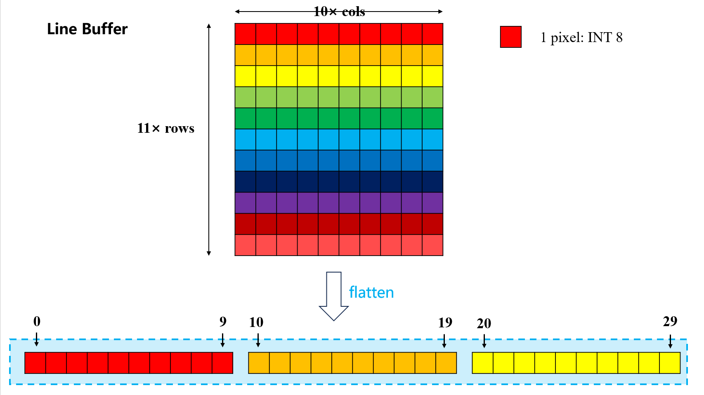
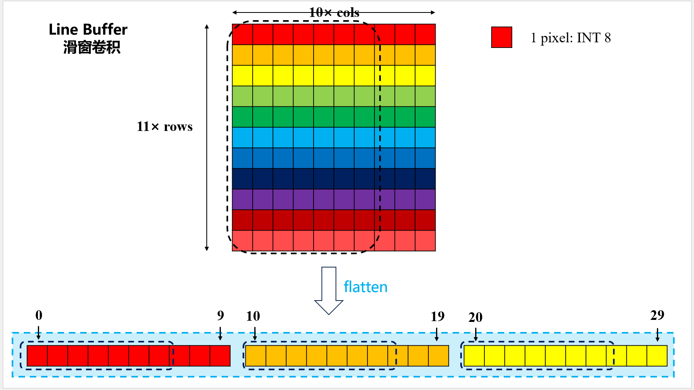
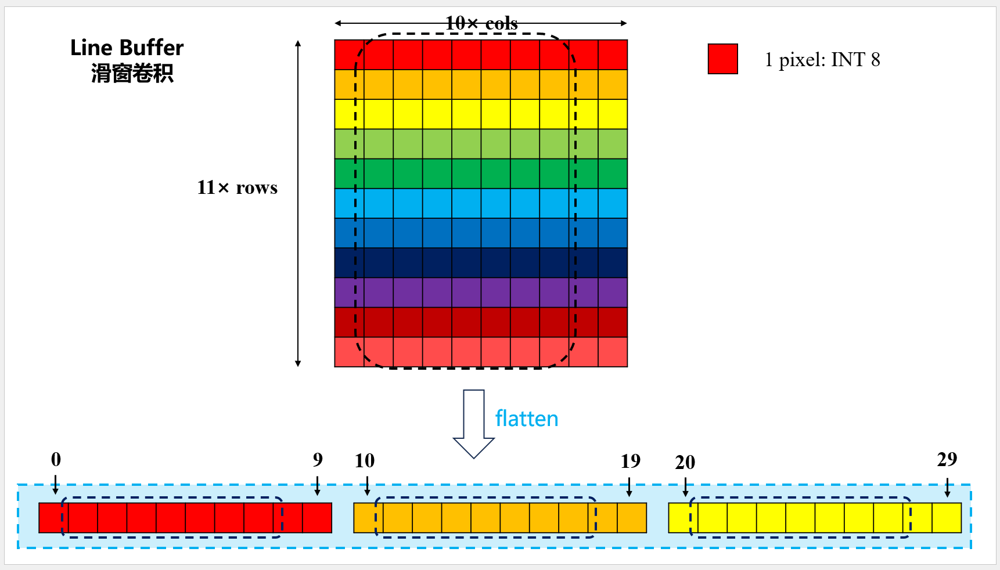

# Line Buffer

> Assited by Claude Opus 4.6

参考代码：
移位寄存器，无循环缓冲：[方案A Verilog](../demo/lb_method_a_regarray.v)
移位寄存器，有循环缓冲：[方案B Verilog](../demo/lb_method_b_ringbuffer.v)

这里主要分析基于**移位寄存器和循环缓冲**实现的 Line Buffer 模块，我们以第一层标准卷积 11×7 为例
```verilog
// 每次推入 1 行数据（从 SRAM 逐行读取），
// 内部用循环缓冲（ring buffer）或移位寄存器维护最新的 KH 行
// 实际项目中这种方式更常见，与真实的数据流方向吻合
```

## I. 内部存储
扁平化数组存储 11 × 10 个 pixel，每个 pixel 8 位，总共 880 位（110 字节）。
这里会涉及到 110 个寄存器，每个寄存器 8 位宽。

## II. 内部存储的写入

**写入时机：** 当前行的卷积结果计算完毕，`col_start` 回绕到 0，表示下一行数据即将进入 Line Buffer。标志就是 `push_row` 信号拉高

**写入方法：循环缓冲**
不必每次写入都将整个 Line Buffer 的数据进行移位，
```verilog
buf[r][c] <= buf[r+1][c];
```
这样会造成大量**动态功耗**，

而是使用一个写指针 `wr_ptr` 来指示当前写入位置。每次写入新行后，写指针的更新公式：

$$\text{wr\_ptr} = (\text{wr\_ptr} + 1) \bmod \text{KH}$$

由于内部存储数组展平为 1D，实际写入为：
```verilog
slot_flat[wr_ptr * ROW_WIDTH + c] <= new_row[c*8 +: 8];
```



**举例：**
当已经写满11行时，此时`wr_ptr=0`，下一次会把第 0 行丢弃，写入新行到第 0 行的位置，
此时写入会发生什么事情？
```verilog
slot_flat[0 * ROW_WIDTH + c] <= new_row[c*8 +: 8];
```

**逻辑正确！**

此外，真实的写指针更新公式不建议使用取模运算，这会造成较大的逻辑开销，通常会使用条件判断来实现循环，详见 [Verilog-Base](./Verilog-Base.md) -> II. 写指针回绕的高效实现

## III. 数据窗口提取

要从 Line Buffer 中正确提取 11 × 7 的数据窗口，**这里要注意窗口的第一行从哪开始？**

!!! success 回答：从wr_ptr指向的那一行开始

因此数据窗口的第 $i$ 行，实际上对应着 Line Buffer 的第：

$$(\text{wr\_ptr} + i) \bmod \text{KH}$$

行。

RTL 实现时**真实物理地址的计算逻辑**：
```verilog
for (gr = 0; gr < KH; gr = gr + 1) begin : G_ROW
    // ── Step A：计算逻辑行 gr 对应的物理槽位 phys ────────────────
    //
    //   ptr_sum = wr_ptr + gr（gr 是常量，wr_ptr 是运行时 4bit 信号）
    //   需要 5bit 容纳求和结果（最大 10+10=20）
    //
    //   phys = ptr_sum % KH，用减法实现（避免除法器）：
    //     · ptr_sum 范围 [gr, gr+10]
    //     · 若 ptr_sum ≥ KH(=11)：phys = ptr_sum - 11（结果 0..9）
    //     · 若 ptr_sum < KH     ：phys = ptr_sum（结果 0..10）
    //   两种情况结果都在 [0, 10]，4bit 足够表示。
    //
    wire [4:0] ptr_sum;   // 5bit，容纳 wr_ptr(0..10) + gr(0..10)，最大 20
    wire [4:0] ptr_diff;  // ptr_sum - KH，用于取模减法
    wire [PTR_BITS-1:0] phys;  // 物理槽位索引（0..10，4bit 足够）

    // gr 在 generate 展开后为常量（0, 1, ..., 10）
    // "wr_ptr + gr" 综合为"4bit 信号加常数"，得到 5bit 结果
    // 注意：Verilog 整数（integer）运算为 32bit，赋值给 ptr_sum[4:0] 时截断，
    //       因最大值 20 < 32，截断不丢失信息。
    assign ptr_sum  = wr_ptr + gr;            // wr_ptr(4bit) + gr(常量) → 5bit
    assign ptr_diff = ptr_sum - KH;           // KH=11，当 ptr_sum>=11 时有效
    // 减法实现取模：综合为 1 个 5bit 减法器 + 1 个比较器 + 1 个 4bit 2:1 MUX
    assign phys = (ptr_sum >= KH) ? ptr_diff[PTR_BITS-1:0] : ptr_sum[PTR_BITS-1:0];
```

**数据选择逻辑：**
地址展平公式：
$$\text{addr}(c, r, w) = r \times W + \text{col\_start} + c$$
```verilog
assign flat_idx = phys * ROW_WIDTH + col_start + gc;
//                 ↑运行时  ↑参数常数    ↑运行时  ↑generate常数

assign window[(gr * KW + gc) * 8 +: 8] = slot_flat[flat_idx];
```

示意图：




## IV. 寄存器移位实现与写指针实现的开销对比

| 对比维度 | 方法 A（寄存器阵列） | 方法 B（循环缓冲） |
|----------|----------------------|--------------------|
| 内部存储 | 110 个 8bit DFF     | 110 个 8bit DFF + 1个 4bit 写指针 |
| push_row 时 | 110 个 DFF 全部动作 | 10+1=11 个 DFF 动作 |
| DFF 翻转次数 | （移位100 + 写入10） | （写入10 + 指针更新1） |
| 窗口读取 MUX | 77 个 4:1 MUX（8bit） | 77 个 110:1 MUX（8bit） |
| （额外组合面积） | （每行直接索引，仅列选择） | （行+列均需动态选择） |
| 设计复杂度 | 简单，直观 | 较复杂（指针/取模逻辑） |
| 适用情况 | KH 较小（如 DWConv KH=3） | KH 较大（Conv KH=11）， 关注动态功耗 |