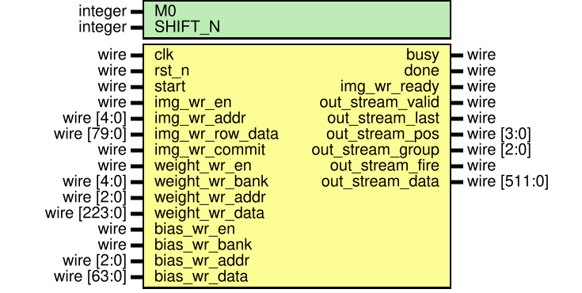

# Conv 子系统架构说明

## I. 整体架构

本子系统实现 CNN 加速器中的第一层核心计算层：标准卷积。
1. 输入： $C\times H\times W = 1\times 30\times 10$ 的输入特征图（Feature map），每个数据位宽 INT8
2. 卷积核尺寸： $N\times C\times H\times W = 32\times 1\times 11\times 7$ ，每个权重位宽 INT8
3. 偏置： $N = 32$ 个偏置，每个数据位宽 INT16
4. 输出特征图尺寸： $C\times H\times W = 32\times 20\times 4$ ，每个数据位宽 INT8

## II. 计算思路

### 2.1 每次执行的数据尺寸和数据量——Token 定义
采用流水线架构设计，每次处理的数据量为：
1. **输入端**：Feature map 的一部分（一个维度为 $H\times W=14\times10$ ）的**窗口**，我们称为一个 **pos**。每个窗口包含16个卷积窗口，因为 $11\times7$ 尺寸的卷积核在行方向和列方向都能滑动4次。
    > 为了覆盖整个输入特征图，最终生成 PWConv 输出 9×32 中的每通道的9个输出值，可以知道，这个卷积窗口需要在输入特征图上**滑动9次**，每次向下滑动 **2** 行，因此 pos 的取值范围是 $0\sim 8$ 
2. **卷积核**：每次处理**4个卷积核**，我们称为一个 **group**，总共将32个卷积核分成8个 group
3. **输出端**：对应的输出特征图的一部分，即一块维度为 $C\times H\times W = 4\times 4\times 4$ 的数据块，我们称为一个 **tile**

### 2.2 吞吐
我们在设计架构的时候，目标是期望 Conv 层保证在启动流水线后，**每个周期都能输出一个 tile 的数据块**，直到所有卷积核和输入特征图的卷积窗口都被处理完，总共需要耗费 $|\text{pos}|\times |\text{group}| = 72$ 个周期。（ $|\text{var}|$ 表示 var 能够取值的数量）。

因此，要满足 $1000k \text{FPS}$ 的指标，所需要的时钟频率 $f_{\text{std}}$ 和输出所有 tile 的周期数 $N$ 之间的关系为：

$$f_{\text{std}} = N \text{MHz}$$

因此，在本设计下，实现 $1000k \text{FPS}$ 的目标需要至少 72MHz 的时钟频率。只需要保证工艺提供给我们的频率在无时序为例的情况下大于 72MHz，我们就能满足 $1000k \text{FPS}$ 的指标。

### 2.3 计算顺序
Conv 层在计算时，首先固定 pos，然后每个时钟上升沿更新 group 的值，并发射一次数据，这里的数据包含当前 pos 对应的输入特征图窗口和当前 group 对应的卷积核权重，我们把这一个整体称为一个 **token**。一张图可以被我们划分为 72 个 token。

在 group 更新到 7 后，pos 更新到 1，group 从 0 开始重新更新，直到 pos 更新到 8，group 更新到 7，整个图的计算完成。

**因此，Conv 只层需要在 72 个时钟上升沿发射完所有 72 个 token，之后每个周期都能输出一个 tile 的数据块。**

例如：
在一个时钟上升沿， $\text{pos} = 0, \text{group} = 0$ 时，此时窗口为输入特征图最上方的14行数据，即： $\text{row} \in [0,13], \text{col} \in [0,9]$ ，卷积核对应32个卷积核中的前4个，即$0\sim3$。
此后下一个时钟上升沿， $\text{pos} = 0, \text{group} = 1$ ，此时窗口不变，卷积核 group 变为后四个，即$4\sim7$。

以此类推，最终在72个时钟周期内，全部数据发射进入流水线，并且一段时间之后，每个周期都能输出一个 tile 的数据块。

## III. RTL 模块解析

### 3.1 模块列表

当前 `SonicBolt/src/conv` 目录中，主通路模块如下：

1. `conv_subsystem.v`：**顶层模块**，连接输入缓存、参数 SRAM 和计算核心。
2. `conv_param_store.v`：**片上 SRAM 封装**，保存 Conv 整层全部权重和全部偏置，向 `conv_core` 按 group 提供当前 token 需要的参数切片
3. `conv_shared_input_buffer.v`：**输入缓存**，管理输入图像的双缓冲 shadow cache，对计算核心输出 `14x10` 输入窗口
4. `conv_pos_window_gen.v`：**窗口生成器**，根据 `pos` 从输入图中切出 `14x10` 窗口，纯组合逻辑实现。
5. `conv_core.v`：**计算核心**，按 `{pos, group}` 发出 token，驱动 MAC 与量化链路
6. `conv_tile_mac.v`：**MAC 核心**，计算一个完整 `4(ch) x 4(row) x 4(col)` INT32 tile，下属各级流水线多个模块。
7. `conv_rescale_relu.v`：**量化激活模块**，对 64 个 `INT32` 结果做统一量化和 ReLU，下属各级流水线多个模块。
8. `conv_sram_sp.v`：**SRAM 行为模型**，实现单端口 SRAM 的读写行为，**仅供仿真使用**。

### 3.2 顶层模块：conv_subsystem

`conv_subsystem` 是 Conv 子系统的顶层模块，主要功能是连接输入缓存、参数 SRAM 和计算核心，完成整个 Conv 层的计算流程，并且向下一级提供输出数据和状态信号。

!!! note "元数据"
    在 conv_subsystem 整个生命周期过程中，我**们用一组元数据信号来描述当前正在处理的 token 的语义**，这组信号包含：
    (1) valid: 当前 token 是否有效，即是否正在处理一个合法的 pos/group 组合
    (2) last: 当前 token 是否是最后一个 token
    (3) pos：当前输入窗口在输入特征图上的位置，取值范围
    (4) group：当前卷积核组，取值范围

### 3.3 输入缓存：conv_shared_input_buffer

当前 Conv 输入图为： $30 \times 10 \times 8\text{bit}$ ，整帧总数据量为： $30 \times 10 \times 8 = 2400\text{bit}$

当前版本直接在 `conv_shared_input_buffer` 内维护两份整帧双缓冲 cache：`frame_cache0` 和 `frame_cache1`，它们分别对应系统语义上的：`ping`和`pong`

通过 `active_buf_sel` 选择当前哪一帧参与计算，另一帧则可继续被外部写入。

### 3.4 权重与偏置组织：conv_param_store
当前 Conv 不是只保存“当前计算正在使用的参数”，而是**在层内 SRAM 中完整保存整个 Conv 层的全部参数**。运行时只是按 group 从中读取当前 token 所需的切片。

#### 3.4.1 权重 bank
当前 Conv 权重不是打包成一个超宽单 word，而是拆成 $11$ 个 bank：
- $11$ 个 kernel_row
- 每个 kernel_row 直接对应 1 个 bank
- 每个权重 bank 的规格为： $8\text{(depth)}\times224\text{bit(word)}$

位宽来源是： $4(\text{channels})\times 7(\text{weights})\times 8(\text{bit}) = 224\text{bit}$
深度 $4$ 则对应： $8$ 个输出通道组 $\text{group}=0\sim 7$
bank 编号规则为： $\text{bank} = \text{kernel-row}$

所以对于一个固定 $\text{group}$ ，11 个 bank 同时读出后，可以拼成完整的： $4 \times 11 \times 7 \times 8\text{bit} = 2464\text{bit}$

这正是 `conv_tile_mac` 的权重输入总线宽度。

#### 3.4.2 bias bank
bias 采用 1 个 bank：每个 bank $8(\text{depth})\times 64\text{bit(word)}$

位宽来源是： $4 \times \text{INT16} = 64\text{bit}$

一个 bank 读出后，可以得到当前 group 的完整： $4 \times \text{INT16} = 64\text{bit}$

这 11 个权重 bank 和 1 个偏置 bank 共同覆盖的是：

- Conv 全部 $32$ 个输出通道
- 全部 $11 \times 7$ 卷积核权重
- 全部 $32$ 个 bias

后续 SonicBolt 其余计算层也遵循相同原则。

### 3.5 计算核心：conv_core
conv_core 的主要功能是根据当前的 pos 和 group **发出请求信号、参数地址**，然后**接收**输入缓存和 SRAM 传回的**数据和参数(Token)**，**驱动 MAC 与量化链路**。

#### 3.5.1 交互接口
conv_core 与 conv_shared_input_buffer 以及 conv_param_store 之间的接口为总线直连，conv_core 在一个时钟上升沿直接发出地址和请求信号，等待数据和参数返回，下一个时钟上升沿就能得到完整的 token。

#### 3.5.2 MAC 单元

conv_core 内部包含一个 conv_tile_mac 模块，负责计算一个完整的 `4(ch) x 4(row) x 4(col)` INT32 tile。

conv_tile_mac 内部包含三级流水线，分别对应三个计算模块：
1. `conv_tile_mac_input_stage`：只做寄存，不做算术，把输入窗口、参数总线和元数据先切开，避免上游切窗和下游乘法直连
   - input/output: 14x10x8bit 输入窗口、11×4×7×8bit 权重、4×16bit 偏置
2. `conv_tile_mac_row_mult`：11 模块并行的乘法单元，每个模块计算一个 kernel_row 的乘加结果，输出 64 个 INT19 的部分和
   - input: 4×10×8bit 输入条带，及其对应的4×7×8bit 卷积核行
   - output: 4×4×4×19bit 部分和
3. `conv_tile_mac_row_add`：对 11 个 kernel_row 行和以及偏置求和，固定实现为 11 -> 1。
   - input: 11×(4×4×4×19bit) 部分和
   - output: 4×4×4×32bit 结果

此外，在流水线执行过程中，MAC 单元还封装了 `conv_tile_mac_meta_pipe`(元数据打拍模块) 和 `conv_tile_mac_bias_pipe`(偏置打拍模块)，**保证元数据和偏置能够在时序上正确对齐**到最终输出的 tile。

#### 3.5.3 量化激活单元

conv_core 内部还包含一个 conv_rescale_relu 模块，负责对 conv_tile_mac 输出的 64 个 INT32 结果做统一量化和 ReLU。

conv_rescale_relu 内部包含两级流水线，分别对应两个计算模块：
1. `conv_rescale`：量化流水第 1 级，负责 64 个 INT32 与常数 M0 的乘法以及移位 SHIFT_N。
   - input: 4×4×4×32bit 输入结果
   - output: 4×4×4×32bit Rescale 结果
2. `conv_rescale_shift_stage`：量化流水第 2 级，对 Rescale 结果执行 ReLU 和饱和截断。
   - input: 4×4×4×32bit Rescale 结果
   - output: 4×4×4×8bit ReLU和饱和截断结果

### IV. RTL 阅读指导
在阅读 conv 的 RTL 代码时，建议按照以下顺序：
1. 从顶层 `conv_subsystem.v` 开始，理清各个模块之间的连接关系和数据流向。**此时不必太在意每个 wire 或者 reg 的具体含义以及生命周期，遇到不懂的，先看子模块**。
2. 阅读 `conv_shared_input_buffer.v`，理解输入缓存的双缓冲设计和 `pos_window_gen` 的窗口切出逻辑。
3. 阅读 `conv_param_store.v` 以及 `conv_sram_sp.v`，理解权重和偏置的 bank 组织结构
4. 阅读 `conv_core.v`（**核心**），理解 token 的发出逻辑，以及 conv_tile_mac 和 conv_rescale_relu 的调用关系。这个模块是整个第一层 Conv 子系统的计算和调度核心，它负责发出请求信号、地址，接受数据，执行卷积和量化计算。同 conv_subsystem.v 一样，不必先深究每个 wire 或 reg 的含义，简单理一理子模块连接关系，然后先看子模块。
5. 阅读 `conv_tile_mac.v`，理解 `conv_core` 内部的 MAC 计算细节。这个模块是整个第一层 Conv 子系统的计算核心，它负责执行卷积计算，包含三级流水线：输入寄存、行乘、求和。这个模块以及下属各个子模块，配合注释，理解起来很容易。
6. 阅读 `conv_rescale_relu.v`，理解 `conv_core` 内部的量化激活计算细节。这个模块是整个第一层 Conv 子系统的量化激活核心，它负责执行量化和 ReLU，包含两级流水线：Rescale、ReLU+饱和截断。同 `conv_tile_mac.v`，这个模块理解起来也很容易。