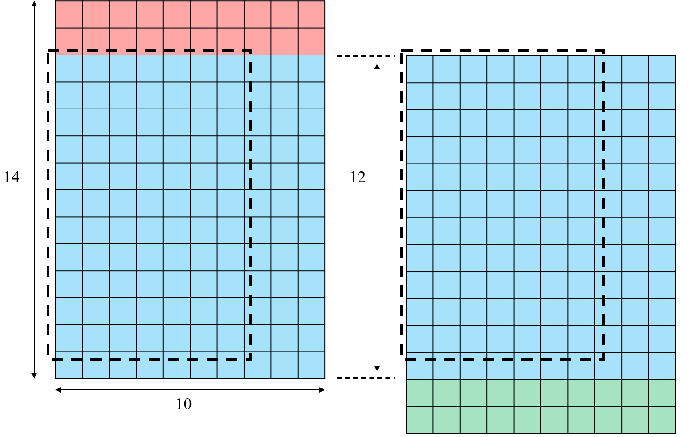

# Conv 子系统架构说明

> 当前系统所属版本：SonicBolt: Conv v2.7

## I. 整体架构

本子系统实现 CNN 加速器中的第一层核心计算层：标准卷积。
1. 输入： $C\times H\times W = 1\times 30\times 10$ 的输入特征图（Feature map），每个数据位宽 INT8
2. 卷积核尺寸： $N\times C\times H\times W = 32\times 1\times 11\times 7$ ，每个权重位宽 INT8
3. 偏置： $N = 32$ 个偏置，每个数据位宽 INT16
4. 输出特征图尺寸： $C\times H\times W = 32\times 20\times 4$ ，每个数据位宽 INT8

## II. 计算思路

### 2.1 每次执行的数据尺寸和数据量——Token 定义
采用流水线架构设计，每次处理的数据量为：
1. **输入端**：Feature map 的一部分（一个维度为 $H\times W=14\times10$ ）的**窗口**，我们称为一个 **pos**。每个窗口包含16个卷积窗口，因为 $11\times7$ 尺寸的卷积核在行方向和列方向都能滑动4次。
    > 为了覆盖整个输入特征图，最终生成 PWConv 输出 9×32 中的每通道的9个输出值，可以知道，这个卷积窗口需要在输入特征图上**滑动9次**，每次向下滑动 **2** 行，因此 pos 的取值范围是 $0\sim 8$ 
2. **卷积核**：每次处理**4个卷积核**，我们称为一个 **group**，总共将32个卷积核分成8个 group
3. **输出端**：对应的输出特征图的一部分，即一块维度为 $C\times H\times W = 4\times 4\times 4$ 的数据块，我们称为一个 **tile**

### 2.2 吞吐
我们在设计架构的时候，目标是期望 Conv 层保证在启动流水线后，**每个周期都能输出一个 tile 的数据块**，直到所有卷积核和输入特征图的卷积窗口都被处理完，总共需要耗费 $|\text{pos}|\times |\text{group}| = 72$ 个周期。（ $|\text{var}|$ 表示 var 能够取值的数量）。

因此，要满足 $1000k \text{FPS}$ 的指标，所需要的时钟频率 $f_{\text{std}}$ 和输出所有 tile 的周期数 $N$ 之间的关系为：

$$f_{\text{std}} = N \text{MHz}$$

因此，在本设计下，实现 $1000k \text{FPS}$ 的目标需要至少 72MHz 的时钟频率。只需要保证工艺提供给我们的频率在无时序为例的情况下大于 72MHz，我们就能满足 $1000k \text{FPS}$ 的指标。

### 2.3 计算顺序
Conv 层在计算时，首先固定 pos，然后每个时钟上升沿更新 group 的值，并发射一次数据，这里的数据包含当前 pos 对应的输入特征图窗口和当前 group 对应的卷积核权重，我们把这一个整体称为一个 **token**。一张图可以被我们划分为 72 个 token。

在 group 更新到 7 后，pos 更新到 1，group 从 0 开始重新更新，直到 pos 更新到 8，group 更新到 7，整个图的计算完成。

**因此，Conv 只层需要在 72 个时钟上升沿发射完所有 72 个 token，之后每个周期都能输出一个 tile 的数据块。**

例如：
在一个时钟上升沿， $\text{pos} = 0, \text{group} = 0$ 时，此时窗口为输入特征图最上方的14行数据，即： $\text{row} \in [0,13], \text{col} \in [0,9]$ ，卷积核对应32个卷积核中的前4个，即$0\sim3$。
此后下一个时钟上升沿， $\text{pos} = 0, \text{group} = 1$ ，此时窗口不变，卷积核 group 变为后四个，即$4\sim7$。

以此类推，最终在72个时钟周期内，全部数据发射进入流水线，并且第一个 token 发射出去的一段时间之后，每个周期都能输出一个 tile 的数据块。

### 2.4 Conv v2.7 新增: 半窗缓存机制

v2.6 及之前版本中，我们不妨设想，**输入层向 Conv 层提供的相邻两个 pos 的数据窗口之间是否有重合的数据**？
**——答案是有的！**
因为相邻 pos 数据窗口在行方向上只相差2行。比如 pos = 0 对应输入 feature map 的 $\text{row} \in [0,13]$ ，pos = 1 对应输入 feature map 的 $\text{row} \in [2,15]$ ，两者在 $\text{row} \in [2,13]$ 上有重叠，重叠部分为 10 行。更糟糕的是，这两个 pos 在参与运算时，**卷积核的滑动也是有重合的！**
下图直观展示了这一现象：

即相邻两个 pos 输入窗口重合有 12 行 10 列数据，同一个 group 的卷积核，在这个 12 x 10 窗口上进行滑动时，所进行的运算就是重复运算。而且这样的重复运算量还不低！11 x 7 大小的卷积核会在行方向和列方向分别滑动 2 次和 4 次，**因此对于一个卷积核，就会有 8 个窗口的卷积运算是浪费的**！

我们用所消耗的乘法器数量来估算重复计算量：一个卷积窗口需要 $11\times7=77$ 个INT8乘法器，一个pos数据窗口总共 16 个窗口中，重复的窗口就有 8 个，因此每个卷积核就会有 $77\times8=616$ 个乘法器的计算是重复的。对于一个 group 的 4 个卷积核来说，就会有 $616\times4=2464$ 个乘法器的计算是重复的。**也就是说，我们的 Conv 层核心计算模块中，4928 个乘法器中，有50%的乘法器都是重复的！这无疑是非常浪费面积和功耗的。**

为此，我们在 v2.7 版本中，引入了**半窗缓存机制**：每个 pos 我们还是维持 14 x 10 的数据窗口（为了代码改动最小），**但是每次只计算 $\text{row} \in [0, 11] , \text{col} \in [0, 9]$ 的数据**，总共 8 个滑动窗口。这样，相邻两个 pos 之间就没有重叠的计算了，消耗的 INT8 乘法器数量从 4928 个降低到了 2464 个。

但是，如果每次只算出 8 个窗口，则输出就是 $4(ch) \times 2(row) \times 4(col)$ 的窗口，但是 DWConv 层每次还是需要 $4(ch) \times 4(row) \times 4(col)$ 的窗口，也就是说 DWConv 层需要的 $4(ch) \times 4(row) \times 4(col)$ 窗口中，有一半数据是 Conv 层计算出来的上一个 pos 的 $4(ch) \times 2(row) \times 4(col)$ 窗口数据——这也就是说，我们必须在 Conv 层之间维护一个 $8(group) \times 4(ch/group) \times 2(row) \times 4(col) \times 8(bits)$ 的寄存器来存放上一个 pos 的计算结果，以供下一个 pos 的计算使用。在 Conv 层每次计算出一个 $4(ch) \times 2(row) \times 4(col)$ 的窗口之后，**需要与寄存器中上一个 pos 的 $4(ch) \times 2(row) \times 4(col)$ 的窗口进行拼接**，组成 DWConv 层需要的 $4(ch) \times 4(row) \times 4(col)$ 的窗口。同时，需要把当前计算出的 $4(ch) \times 2(row) \times 4(col)$ 的窗口存入寄存器**覆盖掉上一个 pos 的结果**，以供下一个 pos 的计算使用。

这样的后果就是，我们必须用前 8 个周期计算出第一个 pos 的 $4(ch) \times 2(row) \times 4(col)$ 的半窗口，接下来计算出来的半窗才能与寄存器中上一个 pos 的半窗进行拼接输出，因此第一个 pos 的半窗口的计算结果会在第 9 个周期才输出，之后每个周期都能输出一个完整的窗口。**因此引入半窗缓存机制后，原来只需用 72 个周期就能发射完毕的 token，现在需要用 80 个周期来完成发射，也就是说，电路的极限吞吐能力从原来的 1 feature map/ 72 cycles降低为 1 feature map/ 80 cycles**。

## III. RTL 模块解析

### 3.1 模块列表

当前 `SonicBolt/src/conv` 目录中，主通路模块如下：

1. `conv_subsystem.v`：**顶层模块**，连接输入缓存、参数 SRAM 和计算核心。
2. `conv_param_store.v`：**片上 SRAM 封装**，保存 Conv 整层全部权重和全部偏置，向 `conv_core` 提供当前 token 需要的 `11` 条 kernel row 和 bias。
3. `conv_shared_input_buffer.v`：**输入缓存**，使用 SRAM 保存完整输入图，并维护当前 `pos` 对应的 `14` 行工作集（Register），执行预取逻辑和双帧缓存逻辑。
4. `conv_core.v`：**计算核心**，按 `{pos, group}` 发出 token，驱动输入工作集切换、参数读取、MAC 与量化链路。
5. `conv_tile_mac.v`：**MAC 核心**，基于 `11` 级 `row PE` 串接，计算一个完整 `4(ch) x 2(row) x 4(col)` INT32 tile。

**注意：**
在 v2.5 版本中，由于 DWConv 子系统已经设计完成并且通过了测试，Conv 和 DWConv 共享的大量公共模块（例如：SRAM 行为模型、参数 bank 组织结构、bias 打拍模块、元数据打拍模块等）被收集到 `utils/` 目录下，例如：
1. `rescale_relu.v`：**量化激活模块**，对 $4\times \text{TILE-H} \times \text{TILE-W}$ 个 `INT32` 结果做统一量化和 ReLU，下属各级流水线多个模块。其中 $\text{TILE-H}$ 和 $\text{TILE-W}$ 分别表示 tile 的高度和宽度。
2. `mult_cell.v` ：**乘法单元**，一个支持 INT8 x INT8 的乘法单元。在 Conv 层的 MAC 阵列中多次被用到。
3. 原本 Conv 层的 SRAM 行为模型已经被 Memory Compiler 编译出的 SRAM 模块替代，也在 `utils/` 目录下。

### 3.2 顶层模块：conv_subsystem

`conv_subsystem` 是 Conv 子系统的顶层模块，主要功能是连接输入缓存、参数 SRAM 和计算核心，完成整个 Conv 层的计算流程，并且向下一级提供输出数据和状态信号。

!!! note "元数据"
    在 conv_subsystem 整个生命周期过程中，我**们用一组元数据信号来描述当前正在处理的 token 的语义**，这组信号包含：
    (1) valid: 当前 token 是否有效，即是否正在处理一个合法的 pos/group 组合
    (2) last: 当前 token 是否是最后一个 token
    (3) pos：当前输入窗口在输入特征图上的位置，取值范围
    (4) group：当前卷积核组，取值范围
    (5) fire: 告诉 DWConv 开始准备参数，fire 只应该比 valid 数据提前一个周期到来。

### 3.3 输入缓存：conv_shared_input_buffer

当前 Conv 输入图为： $30 \times 10 \times 8\text{bit}$ ，整帧总数据量为： $30 \times 10 \times 8 = 2400\text{bit}$

当前版本的 `conv_shared_input_buffer` 为了实现输入双帧缓存，内置了两套 SRAM 以及 CACHE 硬件：

- 两个 $32 \times 80\text{bit}$ 的单端口 SRAM bank，存储当前计算图以及下一张计算图。
- 两个 $14 \times 80\text{bit}$ 的 `shadow cache reg`，只镜像 SRAM 的前 `14` 行，用于快速建立 `pos=0` 的首个工作集
- 一份当前工作集 `pos_row_data_bus`，保存当前 `pos` 对应的 `14` 行输入
- 一组两行的预取缓存 `prefetched_rows`，用于在当前 `pos` 计算期间预取下一个 `pos` 需要新增的两行

**输入缓存的工作方式**如下：

1. `start_consume` 到来后，选择当前 active bank
2. 当 `conv_core` 第一次请求 `pos=0` 时，直接从对应 `shadow cache` 一次性装入 `14` 行工作集
3. 同一个 `pos` 的 `8` 个 group` **共用同一份工作集**
4. 在消费当前 `pos` 的同时，通过 `consume_tick` **驱动后台预取两条新行**
5. 当请求 `pos+1` 时，把工作集上移 `2` 行，并把两条预取行补到末尾

**双帧缓存的工作方式**如下：
1. 模块内部维护一个2位 `ready_bank_mask` 掩码，告诉计算核心 `conv_subsystem` 哪个 bank 已经准备好可以使用了。同时维护一个 `img_wr_ready` 信号，根据 non-active bank 的 ready 状态告诉外部输入数据是否已经准备好可以写入 SRAM 了。
2. 一旦 `img_wr_ready` 信号有效，外部即会写入数据到内部 non-active bank 对应的 SARM。
3. 一旦某一个 bank 写满，`ready_bank_mask` 中对应的 bit 就会被置位，告诉 `conv_subsystem` 这个 bank 已经准备好了。 
4. 一旦某一个 bank 被选中消费，就会被标记为 active bank。（**该 Bank 被标记为 active 就代表顶层系统认为之前的 active bank 已经消费完毕了，可以开始写新数据了。本模块无需操心谁是 active 谁是 write bank，一切由顶层系统决定。**）

### 3.4 权重与偏置组织：conv_param_store
当前 Conv 不是只保存“当前计算正在使用的参数”，而是**在层内 SRAM 中完整保存整个 Conv 层的全部参数**。运行时只是按 group 从中读取当前 token 所需的切片。

#### 3.4.1 权重 bank
当前 Conv 权重不是打包成一个超宽单 word，而是拆成 $11$ 个 bank：
- $11$ 个 kernel_row
- 每个 kernel_row 直接对应 1 个 bank
- 每个权重 bank 的规格为： $8\text{(depth)}\times224\text{bit(word)}$

位宽来源是： $4(\text{channels})\times 7(\text{weights})\times 8(\text{bit}) = 224\text{bit}$
深度 $4$ 则对应： $8$ 个输出通道组 $\text{group}=0\sim 7$
bank 编号规则为： $\text{bank} = \text{kernel-row}$

所以对于一个固定 $\text{group}$ ，11 个 bank 同时读出后，可以拼成完整的： $4 \times 11 \times 7 \times 8\text{bit} = 2464\text{bit}$

在当前实现中，这组数据不再命名为统一的 `weight_data_bus`，而是通过展平后的 `weight_row_data_bus` 传给 `conv_tile_mac`，其中：

- `weight_row_data_bus[i*224 +: 224]` 对应第 `i` 条 kernel row
- 每条切片内部保存 `4` 个输出通道在该 kernel row 上的 `7` 个 INT8 权重

#### 3.4.2 bias bank
bias 采用 1 个 bank：每个 bank $8(\text{depth})\times 64\text{bit(word)}$

位宽来源是： $4 \times \text{INT16} = 64\text{bit}$

一个 bank 读出后，可以得到当前 group 的完整： $4 \times \text{INT16} = 64\text{bit}$

这 11 个权重 bank 和 1 个偏置 bank 共同覆盖的是：

- Conv 全部 $32$ 个输出通道
- 全部 $11 \times 7$ 卷积核权重
- 全部 $32$ 个 bias

后续 SonicBolt 其余计算层也遵循相同原则。

> 注意: 由于 Memory Compiler 无法提供 depth < 32 的 SRAM，因此我们在实现时，权重 bank 和 bias bank 的 depth 都被扩展到了 32，但实际只有前 8 个地址是有效的。
> 此外，在当前版本(PD-v1.0)中，删除了模块对外暴露的参数 SRAM 写接口。本设计无需考虑 SRAM 的写入总线，为防止 IO PAD 过多干扰后端设计，故删除了 SRAM 写接口，内部 SRAM 的写入使能信号恒无效。

### 3.5 计算核心：conv_core
conv_core 的主要功能是根据当前的 pos 和 group **发出请求信号、参数地址**，然后**接收**输入缓存和 SRAM 传回的**数据和参数(Token)**，**驱动 MAC 与量化链路**。

#### 3.5.1 交互接口
`conv_core` 与 `conv_shared_input_buffer` 以及 `conv_param_store` 之间的接口为总线直连。

当前版本的接口语义已经调整为：

- `conv_core` 不再每拍都请求一个新的 `14x10` 窗口，而是只在初始化和 `pos` 边界请求工作集更新
- 输入缓存向 `conv_core` 返回展平后的 `pos_window_data = 14 x 80bit`
- 参数存储向 `conv_core` 返回展平后的 `weight_data_bus = 11 x 224bit` 和 `bias_data_bus = 64bit`
- `conv_core` 通过 `consume_tick` 通知输入缓存：当前 token 已被真正消费，可以继续推动后台预取

#### 3.5.2 MAC 单元

`conv_core` 内部包含一个 `conv_tile_mac` 模块，负责计算一个完整的 `4(ch) x 4(row) x 4(col)` INT32 tile。

`conv_tile_mac` 在 v2.2 版本内部升级为**四级流水线**（为缓解布线压力，大幅消减长连线及打断大加法树），分别对应以下计算流程：
1. **局部数据打拍**：原 `conv_tile_mac_input_stage` 被废除，改为将数据总线和权重总线的切片下沉到乘法器内部 `conv_tile_mac_row_mult` 的第一级打拍。避免了外围巨大总线的 Fanout。偏置则通过 `conv_tile_mac_bias_pipe` 单独打拍。
2. **半窗缓存机制介入**：v2.7 版本引入半窗缓存机制后，以下所有模块的流水级数不变，但是输入输出位宽以及运算单元数量均减半。
3. `conv_tile_mac_row_mult`：内部包含 2 级流水（局部寄存输入 + 行乘法计算）。11 个模块并行计算对应的 kernel_row 乘加结果，输出 32 个 INT19 的部分和。
   - input: 2x10x8bit 输入条带，及其对应的 4×7×8bit 卷积核行
   - output: 4x2x4x19bit 部分和（经内部打拍输出）
4. `conv_tile_mac_row_add`：作为后续的第 3、4 级流水，对 11 个 kernel_row 的部分和极偏置进行归约。为了切断 12 个操作数构成的庞大加法树，模块内部已被显式分割为两级时序：第一拍对 12 个输入执行两两相加存入 Register 堆，第二拍汇总得出 64 个最终结果。
   - input: 11x(4x2x4x19bit) 部分和
   - output: 4x2x4x32bit 结果

此外，在流水线执行过程中，MAC 单元还封装了 `meta_pipe`(元数据打拍模块)，随数据流水深度一同扩充以**保证元数据能够在时序上严格对齐**到最终输出的 tile（现共需打 4 拍以匹配上述内部流水级）。

#### 3.5.3 量化激活单元

`conv_core` 内部还包含一个 `conv_rescale_relu` 模块，负责对 `conv_tile_mac` 输出的 64 个 INT32 结果做统一量化和 ReLU。

`conv_rescale_relu` 内部包含**两级流水线**，分别对应两个计算模块：
1. `rescale`：量化流水第 1 级，负责 32 个 INT32 与常数 M0 的乘法以及移位 SHIFT_N。
   - input: 4x2x4x32bit 输入结果
   - output: 4x2x4x32bit Rescale 结果
2. `relu_saturate`：量化流水第 2 级，对 Rescale 结果执行 ReLU 和饱和截断。
   - input: 4x2x4x32bit Rescale 结果
   - output: 4x2x4x8bit ReLU和饱和截断结果

### IV. RTL 阅读指导
在阅读 conv 的 RTL 代码时，建议按照以下顺序:
1. 从顶层 `conv_subsystem.v` 开始，理清各个模块之间的连接关系和数据流向。**此时不必太在意每个 wire 或者 reg 的具体含义以及生命周期，遇到不懂的，先看子模块**。
2. 阅读 `conv_shared_input_buffer.v`，理解输入 bank SRAM、`shadow cache`、14 行工作集维护、预取逻辑以及输入双帧缓存逻辑。该模块是整个 CNN 项目中控制逻辑最复杂的模块，建议阅读时多画图理解。
3. 阅读 `conv_param_store.v`，理解权重和偏置的 bank 组织结构
4. 阅读 `conv_core.v`（**核心**），理解 token 的发出逻辑，以及 `conv_tile_mac` 和 `rescale_relu` 的调用关系。这个模块是整个第一层 Conv 子系统的计算和调度核心，它负责发出请求信号、地址，接受数据，执行卷积和量化计算。同 `conv_subsystem.v` 一样，不必先深究每个 wire 或 reg 的含义，简单理一理子模块连接关系，然后先看子模块。
5. 阅读 `conv_tile_mac.v`，理解 `conv_core` 内部的 MAC 计算细节。这个模块是负责执行卷积算术的核心，经历了布线层面的深度抗拥塞优化（v2.2）：打散了外部寄存器改为局部锁存，并将超大加法树截断为多级流水。增加输入双帧缓存提升吞吐（v2.6）；增加半窗缓存消除重复计算、减小面积开销（v2.4）。配合模块及其子模块内部的详细注释，理解起来并不难。
6. 阅读 `utils/rescale_relu.v`，理解 `conv_core` 内部的量化激活计算细节。这个模块是整个第一层 Conv 子系统的量化激活核心，它负责执行量化和 ReLU，包含两级流水线：Rescale、ReLU+饱和截断。同 `conv_tile_mac.v`，这个模块理解起来也很容易。
