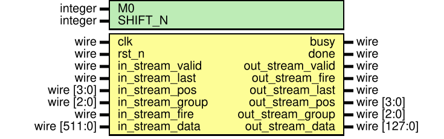

# DWConv 子系统架构说明

> 当前系统所属版本：SonicBolt: DWConv v1.1

## I. 整体架构
本子系统实现 CNN 加速器中 Conv 层的后续处理：标准 Depthwise Convolution（逐通道的 $3\times 3$ 深度卷积）、量化和 ReLU 激活。它用于承接上一层 Conv 的输出。
1. 输入特征图： $C\times H\times W = 32\times 20\times 4$ ，每个数据位宽 INT8
2. 卷积核尺寸： $N\times C\times H\times W = 32\times 1\times 3\times 3$ ，每个权重位宽 INT8
3. 偏置： $N = 32$ 个偏置，每个数据位宽 INT16
4. 输出特征图尺寸： $C\times H\times W = 32\times 18\times 2$ ，每个数据位宽 INT8

此处的 DWConv 不做跨通道求和，每个输入通道只与自己的 $3\times 3$ 卷积核相乘，最终输出通道数与输入通道数保持一致，仍然为 32。
从系统连接关系上看，DWConv 子系统直接接收 Conv 子系统输出的 tile stream（Conv 输出单个 token 为 $4\text{(ch)} \times 4\text{(row)} \times 4\text{(col)}$ 个 INT8 数据，DWConv 输出单个 token 为 $4\text{(ch)} \times 2\text{(row)} \times 2\text{(col)}$ 个 INT8 数据 ）。

## II. 计算思路

### 2.1 每次执行的数据尺寸和数据量 —— tile
DWConv 仍然沿用与 Conv 一致的流式 token 调度处理架构，但它**消费的是上一层已经算好的 Conv tile**。每次处理的数据量为：
1. **输入端**：来自于 Conv 的一个维度为 $C\times H\times W = 4\times 4\times 4$ 的输入 tile。
2. **卷积核**：每次处理**4个输入通道**对应的 $3\times3$ depthwise 权重和 4 个 bias，总共将 32 个通道按 4 个一组拆分为 8 个 group。每一个 Conv tile 参与计算时，DWConv 卷积核会在 $H$ 和 $W$ 方向上分别滑动2次，形成 4 个滑动窗口。 
3. **输出端**：对应的输出特征图的一部分，即一块维度为 $C\times H\times W = 4\times 2\times 2$ 的 tile（因为执行的是 $3\times 3$ 卷积，输入 $4\times 4$ 会产生 $2\times 2$ 的输出）。

### 2.2 吞吐
DWConv 采用 tile 级流式处理。设计目标与 Conv 一样，是在流水线填满后做到：每次时钟能够接收 1 个输入 token，同时也输出 1 个结果 token。

整张图一共需要处理 $|\text{pos}|\times |\text{group}| = 9 \times 8 = 72$ 个 token。因此处理 1 张图像理论上约需 72 个时钟周期。在半窗缓存机制加入和，该周期数扩大至 80。如果要满足 $\text{FPS}$ 的指标，对应时钟频率需求 ${f_{\text{std}}}$ 与周期数 $N$ 的关系为：

$$f_{\text{std}} = N \text{MHz} = 80 \text{MHz}$$

当然，实际系统频率还要结合握手停顿、上游供数和下游回压综合考虑。

### 2.3 计算顺序
DWConv 的调度顺序很简单，不需要像 Conv 一样考虑与 input buffer 的通信，不需要主动去“要”数据。DWConv 只需要启动计算后，Conv 发送的一个 tile 达到后，DWConv 马上开始计算一个 tile 即可。当然，这里也涉及到两个问题：
1. DWConv **需要知道自己在什么时候启动计算**。因为在计算时 DWConv 需要从 SRAM 中获取参数，当地址准备好后，要下一个时钟上升沿才能得到数据，因此，DWConv 不能等第一个 tile 到达(valid元数据有效)后才开始启动对 SRAM 的访问，否则就会错过第一个 tile 的计算时机。为此，我们引入了一个新的元数据：`fire`，`fire` 会在第一个 tile 的 valid 元数据有效的**前一个时钟周期被置高**，通知 DWConv 启动对 SRAM 的访问，从而**获取第一个 tile 所需的参数**。
2. **DWConv 需要知道当前计算的 tile 的 `pos` 和 `group` 坐标**，以便提前从 SRAM 中获取正确的参数。这一点我们通过 Conv 发射 token 的严格顺序来保证（具体参照 [Conv 介绍文档](../../conv/docs/README.md)），即 `group` 优先更新，`pos` 次之。这样 DWConv 只需要在每个时钟上升沿像 Conv 一样更新 `group` 和 `pos` 的值，就能正确对齐参数和输入 tile。

## III. RTL 模块解析

### 3.1 模块列表

当前 `SonicBolt/src/dwconv` 目录中，主通路模块如下：
1. `dwconv_subsystem.v`：**顶层模块**，连接参数存储模块和计算核心模块。
2. `dwconv_param_store.v`：**片上 SRAM 封装**，负责保存整层 DWConv 的权重与偏置，按 group 读取当前所需组合。
3. `dwconv_core.v`：**计算核心**，主调度器与数据通路核心，处理握手、参数对齐、并调用 MAC 和量化。
4. `dwconv_tile_mac.v`：**MAC 核心**，执行完整的 token 级 depthwise 卷积。内部包含行乘法 dwconv_tile_mac_row_mult.v 与累加 dwconv_tile_mac_row_add.v。

同时，为了降低模块冗余，量化激活以及流水打拍组件已通过通用模块进行复用（位于 `src/utils/`，包含 `sram_sp.v`, `meta_pipe.v`, `bias_pipe.v`, `rescale_relu.v` 等）。

### 3.2 顶层模块：dwconv_subsystem

`dwconv_subsystem` 是 `DWConv` 子系统顶层，主要完成三件事：
1. 对**外暴露参数写接口**，用于加载 weight 与 bias。
2. **接收**来自 Conv 的 tile stream。
3. 输出 DWConv 计算完成后的 tile stream.

顶层为内部的 dwconv_core 提供默认重新量化参数（ $M_0 = 59$, $\text{SHIFT-N} = 11$ ）。

### 3.3 权重与偏置组织：dwconv_param_store

DWConv 的参数组织因为不存在跨通道累加，显得更加简化。dwconv_param_store 将参数拆分为两类 bank：

- **权重 bank**：按卷积核行数拆分为 3 个 bank。每个 bank 深度为 8（对应 8 个 group）。单字宽度为 $4\text{(ch)}\times 3\text{(col)}\times 8\text{(bit)} = 96\text{bit}$。也就是说，针对某一 group，一次读取即可同步获取 4 个通道全套所需的 $\times 3$ 权重。
- **Bias bank**：单独存储在一个深度为 8 的 bank 中。单字宽度为 $4\text{(ch)}\times 16\text{bit} = 64\text{bit}$，一次读出后获得这 4 个通道的 bias。

### 3.4 计算核心：dwconv_core

`dwconv_core` 的主要功能是梳理系统数据流并在正确时序调用计算单元：
- **发起并行与对齐**：接收用输入流中的 `in_stream_fire` 指示信号发起参数读取，并且利用严格的`pos`-`group` 更新顺序对齐输入 tile 数据与读出的权重、偏置。
- **控制逻辑**：依赖于 `meta_pipe` 进行 `pos`、`group`、`last` 标志信号等元信息的跨级同步。
- **执行计算与输出**：将对齐好的结果推入 `dwconv_tile_mac`（计算得到 $4\times 2\times 2$ 的 INT32 tile），接着传入 `rescale_relu` 完成量化激活，最后向外输出结果流。

### 3.5 MAC 与量化单元

1. **MAC 阵列** (`dwconv_tile_mac`) 依据 $\times 3$ 算术拆分为清晰的两步走流水线：
   - `dwconv_tile_mac_row_mult` 将输入数据在窗口上切出 3 条 pos_window_data 交给三个实例执行并行的逐元素乘法然后行内求和，其产生 $18\text{bit}$ 宽的中间变量。
   - `dwconv_tile_mac_row_add` 汇总三行得到的部分和，然后加上 bias 并向后输出 $32\text{bit}$。
2. **量化与激活** (src/utils/rescale_relu.v) 作为公共处理逻辑：它先乘系数 M0 并按照 SHIFT_N 右移，将 $48\text{bit}$ 压宿至 $32\text{bit}$；接着在此基准上经过一轮 ReLU-SATURATE（负数截断为0，正向针对 127 饱和截断），最终输出 $4\times 2\times 2 \times 8\text{bit}$ 的结果。

### IV. RTL 阅读指导

在阅读 DWConv 的代码时，建议按照以下顺序：
1. 从顶层 `dwconv_subsystem.v` 开始，建立接口与数据进出边界的概念。可以看见与上游 Conv 系统如出一辙的数据通信格式。
2. 阅读 `dwconv_param_store.v`，理解为了单周期提取 4 个通道所需的 3 行卷积数据，权重和 Bias 是如何分类存储和规划位宽的。
3. 阅读 `dwconv_core.v`（**核心**），理解输入数据在流水线如何等待参数匹配以及复用的元数据 pos/group/last 如何无缝穿挂在流水线上。
4. 阅读 `dwconv_tile_mac.v` 及其子模块，这是真正做数学运算的地方。观察特征图切出的三行数据分别作了乘法、行内求和加上偏置的处理路径，体会乘加分解的精妙之处。
5. 顺带复习一下 `src/utils/` 下的公用模块（如 `meta_pipe.v`, `rescale_relu.v`）。这些模块也是连接量化结果的桥梁及系统流水打拍的润滑剂。
