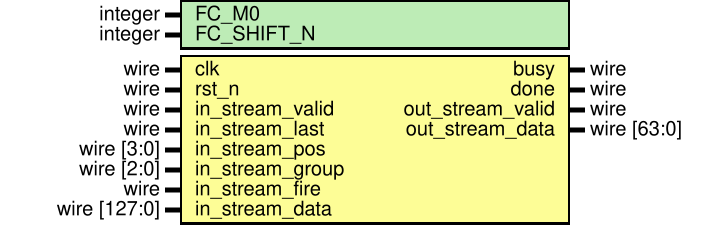

# Post Process 子系统架构说明

> 当前系统所属版本：SonicBolt: Post Process v1.3

## I. 整体架构
本子系统实现 CNN 加速器流中全部后续处理：包含最大池化（MaxPool）、特征图展平（Flatten）、全连接层（FC）以及最终的概率激活（Sigmoid）。
它是数据通路的最后一站：
1. 输入：接收 PWConv 层的流式输出， $C\times H\times W = 32\times 18\times 2$ 的 $8\text{bit}$ 输入。流中包含 $9 \text{ pos} \times 8 \text{ group} = 72 \text{ token}$。
2. 最大池化：每次消耗 $4\text{ch} \times 2 \times 2$ 的输入信息（1个 token），在 $2\times 2$ 空间执行提取最大值，输出为 $4\text{ch} \times 1 \times 1$。经过 72 个 token 后，生成 $32\text{ch} \times 9 \times 1 = 288$ 维特征向量。
3. 全连接层（FC）： 尺寸为 $2\times 288$，将池化后的 288 维向量作为参数与对应类别的权重网络进行全加和并附加偏置，输出 2 种分类得分。
4. Sigmoid 层：查表将两路 INT8 特征转化为预测置信度。

## II. 计算思路

### 2.1 每次执行的数据尺寸和数据量——逐 Token 降维
Post Process 继续承袭流式计算：
1. **MaxPool 提取**：接收到一个由 4 组二维窗口构成的 128bit token 时，对该窗口执行二维 Max（跨通道独立）。产生的 32bit $4\text{ch} \times 1\times 1$ 特征。这样无需完整存储 $32\times 18\times 2$ 特征就能持续规约尺寸。
2. **Flatten 透明映射**：为了维持体系结构边界，展平层不修改维度顺序，它依然利用原有的 `pos` 与 `group` 计数，直接生成对应的扁平化寻址索引，即 $idx = (group \times 4 + lane) \times 9 + pos$。实际上此模块只做管道 1 周期延时缓冲（如前面已分析证明其仅作流水线平齐作用）。
3. **FC 逐词累积（Frame-Level Accumulation）**：FC 不需要等整帧特征输入后才运算，它直接复用来自前端传来的 $32\text{bit}$ MaxPool 特征，每次分别与读取得到的 `class_0` 和 `class_1` 的相应 4 路权重进行内积并加入累加器。经过所有的 72 拍有效 `valid` 后，全帧积分自动完成。

### 2.2 吞吐
FC 的帧级累积非常精巧地掩盖了等待时延：由于整图包含了 72 个 token 并在流处理期间平稳到达。**FC 只要在一拍内完成一组四通道点积与累加，就可以满足 1 拍 1 token 的设计需要**。
只有在接收到 `last` 为高的**最终一个 token** 时（第 72 个令牌），系统才会**输出合并后的完好 32bit 内在激活值**并推送到 Sigmoid。不需要额外的时间挂起全缓冲阵列等待结果。

### 2.3 工作顺序
对于每一个输入的新帧：
1. 随着每一个 PWConv token 的达到，触发池化模块筛选产生对应通道对应 pos 的降维图。
2. FC 以其带有的 `pos\group` 进行寻址提取 `72×64` SRAM 当中的权重与偏置，直接更新帧级累加器（FC Frame Accum）。
3. 随着一张图流转完成（即 `last = 1` 触发），完成帧级量化的缩放处理后，交由硬件 Sigmoid LUT 转换为 0～255 的查找区间直接输出 FP32 结果。 

## III. RTL 模块解析

### 3.1 模块列表
当前 `SonicBolt/src/post_process` 目录中如下：

1. `post_process_subsystem.v`：**顶层模块**，完成 `MaxPool -> Flatten -> FC -> Sigmoid` 流式拼装。并导出最终得分与系统就绪指示 `busy/done`。
2. `maxpool.v`：**2x2 最大池化器**，针对每个四通道子块内的 $2\times 2$ 空间元素同步寻找上限，并提供与前层对应的 `meta_pipe` 对齐特征位置。
3. `post_process_flatten.v`：**维度过渡打拍寄存器**，在系统内部建立清晰时序约束与名称转接。
4. `fc.v`：**全连接网子系统顶层**，用于整合其附属组件：
    - `fc_weight_sram.v` 和 `fc_bias_store.v`：负责通过系统写入权重加载接口读取外部写入参数，同时满足内部 FC 的 `pos/group` 访问寻址。权重存储和偏置存储分别用 SRAM 和寄存器阵列实现。
    - `fc_mac.v`：实现 4 路并行 8 位输入与双层组类权重的乘积与加法级联。提供 $32\text{bit}$ $2\text{class}$ 中间缓存。
    - `fc_frame_accum.v`：经过之前优化，由系统级结构构成的纯净同步组合逻辑反馈更新。实现长周期待处理信号的稳态累积功能。
    - `fc_rescale.v` 与 `fc_saturate.v`：通过 M0 及 `SHIFT_N` 倍乘、右移以及截断，将 32 宽位降维挤压到 8 宽位输入 Sigmoid。
5. `sigmoid.v`：**只读 LUT 映射模块**，通过预置查表实现概率激活换算。

### 3.2 架构特点——Sigmoid 表
在后处理的末端，由于硬件无法处理复杂的自然指数 $1/(1+e^{-x})$。所以系统在准备数据前利用了一个包含 256 位深度 8位宽度的查找表进行直接映射。通过将**原输入值作为寻址器直接抓取该单元FP32值充当分类结果**。该表可由参数总线实现预先载写。

### 3.3 时序说明与修正建议
- FC 权重的加载禁止向模块发起请求（此时 `busy = 1`）。
- 由于全连接要求以帧为尺度集成完整数据。所以其不具备流水的“管状”性质（并非输入端吐出 1 个即有对应结果反馈）。整个流程上需要完整的 $72$ 个周期进行吸收融合。最后产生的是一个孤立有效的信号标示系统识别完成 `out_stream_valid = 1`。

## IV. 时序瓶颈注意点
因为帧的计算必须紧致地接流着最后处理帧运算——若连续不间断涌入**两图**时，上一帧还没能将结果存留或写入下游，它的状态将被重置清理。
这就点出了目前架构的一个核心受限点所在：由于只有一套帧级累加累次器（在 `fc_frame_accum.v`）没有实现如 PWConv 的 `Ping-Pong Buffer` 交替切换的暂存保留逻辑。因此这阻碍了实现紧贴图连轴发射计算的工作任务（无法实现单模块并行交叠）。