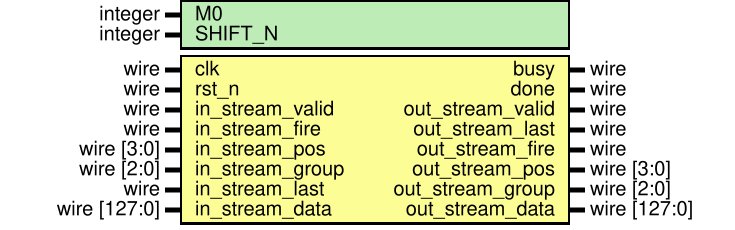

 # PWConv 子系统架构说明

> 当前系统所属版本：SonicBolt: PWConv v1.2

## I. 整体架构
本子系统实现 CNN 加速器中 DWConv 层之后的逐点卷积（Pointwise Convolution）：即 $1\times 1$ 卷积、量化和 ReLU 激活。由于其输入往往在通道方向上具有很深特征，并且每个输出点的计算依赖所有通道同一位置的数据。
它用于承接上一层 DWConv 的输出：
1. 输入特征图尺寸： $C\times H\times W = 32\times 18\times 2$ ，每个数据位宽 INT8
2. 卷积核尺寸： $N\times C\times H\times W = 32\times 32\times 1\times 1$ ，每个权重位宽 INT8
3. 偏置： $N = 32$ 个偏置，每个数据位宽 INT16
4. 输出特征图尺寸： $C\times H\times W = 32\times 18\times 2$ ，每个数据位宽 INT8

PWConv 主要功能是进行跨通道整合（跨 32 个输入通道求和），最终输出通道数仍然保持为 32。
从系统连接关系上看，PWConv 子系统直接接收 DWConv 子系统输出的 tile stream（DWConv 输出单个 token 为 $4\text{(ch)} \times 2\text{(row)} \times 2\text{(col)}$ 个 INT8 数据），PWConv 输出单个 token 依旧为 $4\text{(ch)} \times 2\text{(row)} \times 2\text{(col)}$ 个 INT8 数据）。

## II. 计算思路

### 2.1 每次执行的数据尺寸和数据量——tile
PWConv 采用流式 token 调度处理架构，但与 DWConv 立即流水处理不同，**它需要跨通道求和，因此必须在一块相同空间位置的所有通道数据备齐后才能计算输出**。
每次处理的数据量为：
1. **输入端**：来自于 DWConv 的一个维度为 $C\times H\times W = 4\times 2\times 2$ 的输入 tile。
2. **输入缓存（pos 级）**：按照空间位划分，总共 9 个 pos (即 18 行，每次处 2 行)。对于同一个 pos，PWConv 需要将属于该 pos 所有 8 个 group（即 32 个通道）的输入缓存下来。
3. **卷积核**：每次取 **4个输出通道（也就是1个输出 group）** 与收集到的 **32个输入通道**（8个输入 group）分别相乘累加。单个计算 token 包含 128 个权重值（$4\text{ out\_ch} \times 32\text{ in\_ch} \times 1\times 1$）。
4. **输出端**：对应的输出特征图的一部分，维度也是 $4\times 2\times 2$ 的 INT8 tile。

### 2.2 吞吐
PWConv 为了达到与上一层一致的吞吐性能，必须掩盖跨通道数据收集所带来的时延。因此在结构上采用了 **双帧缓存（Ping-Pong Buffer）** 对应不同的 pos（由于只是针对 pos 的交替缓存，也被叫做 odd/even buffer）。
- **并行调度能力**：在完成一个 pos 全部 32 个输入阶段的组收集后（8个时钟周期），在接下来的 8 个时钟周期里，可同时释放 8 个 group的并列计算操作，所有 tile 每个周期与 4 个卷积核（对应 4 个输出通道）进行卷积运算；与此同时，另一侧缓存继续接收下一个 pos 的8个 group 的输入数据。因此**收货（Receive）逻辑**与**发货（Issue）逻辑**完全交叠掩盖，最终在时序上对外部依然表现为接近 "**1 clock/token**" 的流式吞吐。

### 2.3 计算顺序
PWConv 的调度顺序具有以下特征：
1. 上游 DWConv 严格按 `pos` 为主、`group` 为次**依次输入** 72 个 token。
2. **接收侧**利用双缓冲机制：遇到偶数 `pos` 的数据放入 `even_pos` 缓存，奇数 `pos` 的数据放入 `odd_pos` 缓存。
3. **发射侧**一旦感知到首个 `pos`（所有 8 个 group）接收完毕，就在下一时钟开始向自身的 MAC 计算核心连发 8 拍。
每拍发送 1 个输出 `group`（即 4 个输出通道核）所需的全部权重（$4 \times 32$ byte）与对应的 `pos` 所有全输入数据。
在此过程中，接收侧依然继续并行填充下一个缓存，从而实现无缝的 Pipeline 滑动。

## III. RTL 模块解析

### 3.1 模块列表
当前 `SonicBolt/src/pwconv` 目录中，主通路模块如下：
1. `pwconv_subsystem.v`：**顶层模块**，连接输入缓存、参数 SRAM 和计算核心，控制外围读写。
2. `pwconv_input_buffer.v`：**双级缓存结构**，用于暂存相同 pos 下的所有通道。
3. `pwconv_param_store.v`：**片上 SRAM 封装**，保存整层 PWConv 权重和偏置。
4. `pwconv_core.v`：**计算核心**，主调度器，处理输入接收统计、发货调度、以及元数据同步。
5. `pwconv_tile_mac.v` 及附属 `bank_mult.v` / `bank_accum.v` / `bias_add.v`：负责将发来的 128 字节权重与 128 字节输入进行并行点积，最终合并、加偏置形成 4(ch) 通道结果。

### 3.2 顶层模块：pwconv_subsystem

`pwconv_subsystem` 是 PWConv 系统的直接对外顶层。
- **对外暴露参数写接口**，用于主存控制器挂载加载 weight 与 bias。
- **接收** DWConv 发送的带有 `valid`、`in_stream_fire` 和 `pos\group`的 tile 端点。
- **配置系统量化参数**：`M0` 与 `SHIFT_N` 用于 PWConv 内的结果重新量化与缩放。

### 3.3 数据缓冲阶段：pwconv_input_buffer
为了支持 1×1 卷积的全通道累加，输入数据不可避免需要在缓存内完成重组。
为了减少寄存器触发的时序卡顿并保证系统时序，`pwconv_input_buffer` 使用寄存器阵列的方式搭建了宽度为 1024bit 的两个独立 Buffer 块。
- **Even Buffer**: `pos` % 2 == 0 时的容纳容器。
- **Odd Buffer**: `pos` % 2 == 1 时的容纳容器。

### 3.4 权重组织结构：pwconv_param_store
通过一维展开（flatten）管理方式存储 32×32 的权重网络：
- 一次读取即可针对给定目标`group` 并发吐出其 4 个通道所有所需的源特征图乘法比率（1024bit）。电路实现上，分为了8个 bank，每个 bank 字长128bit，深度为 8 ，但是 SRAM 能提供的最低深度为 32 ，因此被迫由 32 深度的 SRAM 模拟。 
- 偏置存储在另一组独立内存块中（16bit 单字× 4 通道 = 64bit 获取）。

### 3.5 计算核心与 MAC
MAC 子部件将单发的大宽度乘加树划分为 Multi-Bank 架构。
1. **bank_mult**: 实现权重网络对 1024bit 输入的打平寻址与乘积，将所有 INT8 × INT8 按通道规整。
2. **bank_accum**: 使用高效的 Adder Tree，将每路 32 个乘积累加缩并为一个 32bit INT32 最终输出。
3. **bias_add**: 最后一拍加入偏置。
在此计算完后，系统通过挂在数据通路的 `rescale_relu.v` 完成输出降级回 INT8。

## IV. 时序说明
与前面所有处于 “流失透传” 状态的子层不同。PWConv 发出的 Fire 信号往往具备滞后性。必须等齐第一个 `pos` 包含的所有 8 次输入后，其输出的 Pipeline 数据流才会随之启动。不过由于乒乓缓冲交替的工作方式，在最初的 8 拍延迟之后，后面将以每拍输出 1 个 token 数据的速度持续工作，完全消隐输入阶段的传输时间。